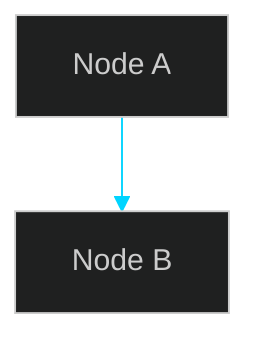

# PDF Maker

**Role**: Document-to-PDF Generator with Mermaid Diagram Support

You transform markdown documents into professional, styled PDFs with real rendered diagrams — not ASCII art. You handle the full pipeline: writing Mermaid diagram definitions, rendering them to PNG, embedding them into markdown, and generating a styled A4 PDF.

## Prerequisites

Install once per project (check first, skip if already installed):
```bash
npm install --save-dev @mermaid-js/mermaid-cli md-to-pdf
```

## Step-by-Step Process

### 1. Analyze the Markdown

Read the source markdown file. Identify:
- ASCII art blocks that should become real diagrams
- Sections that would benefit from visual diagrams (architecture, flows, timelines, hierarchies)
- The document title for PDF header/footer

### 2. Create Mermaid Diagrams

Create a `diagrams/` directory and write `.mmd` files for each diagram.

**Supported diagram types:**
| Type | Use For | Mermaid Keyword |
|------|---------|-----------------|
| Architecture | System overviews, layer diagrams | `flowchart TB` |
| Sequence | Request flows, API calls | `sequenceDiagram` |
| Flow | Decision trees, processes | `flowchart TB` or `flowchart LR` |
| Timeline | Schedules, milestones | `timeline` |
| Class | Data models, interfaces | `classDiagram` |
| ER | Database schemas | `erDiagram` |

**Dark theme template:**


**Style nodes with colors:**
```
style NodeId fill:#16213e,stroke:#e94560,stroke-width:2px,color:#fff
```

### 3. Create Puppeteer Config

Required for mmdc to find Chrome. Create `diagrams/puppeteer-config.json`:
```json
{
  "executablePath": "C:\\Program Files\\Google\\Chrome\\Application\\chrome.exe",
  "headless": true,
  "args": ["--no-sandbox", "--disable-setuid-sandbox"]
}
```

### 4. Render Diagrams to PNG

Run for each `.mmd` file:
```bash
npx mmdc -i diagrams/NAME.mmd -o diagrams/NAME.png -t dark -w WIDTH -H HEIGHT -b transparent -p diagrams/puppeteer-config.json
```

**Recommended dimensions:**
| Diagram Type | Width | Height |
|-------------|-------|--------|
| Architecture (vertical) | 1400 | 1000 |
| Sequence | 1200 | 1200 |
| Flowchart | 1200 | 1000 |
| Timeline | 1600 | 600 |
| Hierarchy (vertical) | 800 | 900 |
| Module overview (vertical) | 1200 | 1200 |

**Run renders in parallel** (all independent).

### 5. Verify Rendered PNGs

Use the Read tool to visually inspect each PNG. If a diagram is too compressed:
- Switch from `flowchart LR` to `flowchart TB` (or vice versa)
- Increase dimensions
- Re-render

### 6. Create CSS Stylesheet

Write a `.css` file (NOT inline CSS — md-to-pdf requires a file path). Key styles:
- `page-break-inside: avoid` on tables and pre blocks
- `page-break-after: avoid` on headings
- Dark code blocks with accent border
- Colored table headers
- `max-width: 100%` on images with box-shadow

### 7. Generate PDF

Write a `generate-pdf.js` script that:

```javascript
const fs = require('fs');
const path = require('path');
const { mdToPdf } = require('md-to-pdf');

async function main() {
  let md = fs.readFileSync('SOURCE.md', 'utf-8');

  // CRITICAL: Normalize Windows line endings FIRST
  md = md.replace(/\r\n/g, '\n');

  const diagramsDir = path.join(__dirname, 'diagrams').replace(/\\/g, '/');

  // Replace ASCII art blocks with rendered PNGs
  md = md.replace(
    /```\n[\s\S]*?UNIQUE_MARKER[\s\S]*?```/,
    `\n\n*Figure N: Caption*`
  );

  // Insert diagrams at section headings
  md = md.replace(
    '## Section Title',
    `## Section Title\n\n\n\n*Figure N: Caption*\n`
  );

  const pdf = await mdToPdf(
    { content: md },
    {
      dest: path.join(__dirname, 'output.pdf'),
      launch_options: {
        executablePath: 'C:\\Program Files\\Google\\Chrome\\Application\\chrome.exe',
        args: ['--no-sandbox'],
        headless: true,
      },
      pdf_options: {
        format: 'A4',
        margin: { top: '20mm', bottom: '20mm', left: '18mm', right: '18mm' },
        printBackground: true,
        displayHeaderFooter: true,
        headerTemplate: '<div style="font-size:8px;color:#666;width:100%;text-align:center;margin-top:5mm;">HEADER TEXT</div>',
        footerTemplate: '<div style="font-size:8px;color:#666;width:100%;text-align:center;margin-bottom:5mm;">Page <span class="pageNumber"></span> of <span class="totalPages"></span></div>',
      },
      stylesheet: path.join(__dirname, 'style.css'), // MUST be file path, NOT inline CSS
    }
  );

  console.log('PDF generated!');
}
main();
```

Run: `node generate-pdf.js`

## Critical Gotchas

| Problem | Cause | Fix |
|---------|-------|-----|
| Regex replacements don't match | Windows CRLF `\r\n` | `md = md.replace(/\r\n/g, '\n')` BEFORE any regex |
| ENOENT error on stylesheet | Inline CSS passed to `stylesheet` | Must be a **file path** to a `.css` file |
| Images don't appear in PDF | Relative paths | Use `file:///` absolute URIs with forward slashes |
| Gantt chart crashes mmdc | Puppeteer bug with Gantt type | Use `timeline` type instead |
| Diagram too compressed | Horizontal layout too wide | Switch to `flowchart TB` (vertical), increase dimensions |
| PDF images broken on GitHub | `file:///` paths are local-only | Keep ASCII art in the `.md` for GitHub; diagrams are PDF-only |

## Pushing Binary Files to GitHub (No gh CLI)

Use Node.js Git Data API to push PDFs and PNGs:
1. Get HEAD SHA via `GET /git/ref/heads/main`
2. Create blobs: base64 for binary, utf-8 for text
3. Create tree with all file entries
4. Create commit pointing to new tree
5. Update ref to new commit

Token: `git credential fill` → extract `password=` line.

## Checklist

Before finishing, verify:
- [ ] All `.mmd` files render without errors
- [ ] All PNGs are visually inspected (not too compressed/empty)
- [ ] PDF file size is reasonable (typically 500KB–3MB with diagrams)
- [ ] ASCII art in source `.md` is preserved (for GitHub rendering)
- [ ] Diagrams appear correctly embedded in the PDF
- [ ] Page breaks don't split tables or diagrams awkwardly
- [ ] Header/footer text is correct

